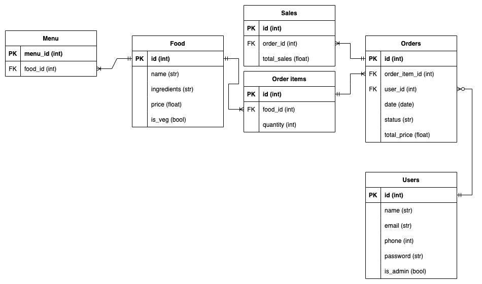

# T2A2

## R1 - Identification of the problem you are trying to solve by building this particular app

What is the app? What problem does it solve?

The app is a simple API Web Server that controls the communication between customers and the restaurant owner. It will allow customers to view the menu and make orders for pickup (pay on pickup). For the restaurant owner, the app will allow them to see orders, update the menu, and view their total orders.

This application will remove the need for a staff member to take phone calls to take orders. It can also act as a replacement for a POS system, by keeping track of the orders, making payment when picking up the orders easy. Lastly, the app will allow the restaurant owner to keep track of past orders for their financial requirements.

---

## R2 - Why is it a problem that needs solving?

Justification for why this app is needed. Why does this problem need solving? Why do we need an app for it?

This application will significantly reduce the operating costs of the restaurant by reducing the amount of staff required. It will also save the restaurant owner money as they will have their own system that will keep track of finances, without the need for further third-party software (Applications like MYOB), or hardware (POS systems).

---

## R3 - Why have you chosen this database system. What are the drawbacks compared to others?

The database system I will be using is PostgreSQL which is a commonly used Database Management System (DBMS), belonging to the Relational Database Management System (RDBMS) variety.

Alike other DBMS such as MySQL, Microsoft SQL Server, and Oracle, they all share a similar syntax as they are all based on SQL which allows developers to easily use these different programs.

Postgres is also open source software, which means that it can be used for free, for whatever business or personal needs you may require. In addition, it's available on Windows, Mac and Linux so it's easily available regardless of your operating system.

Fortunately, there are few disadvantages to PostgreSQL although there a few. One of these is PostgreSQL is slower than MySQL, although for most use cases this won't be too noticable unless you're dealing with very large databases.

Another disadvantage is that PostgreSQL is less supported than MySQL. None of these disadvantages are detrimental to using PostgreSQL, and it is still a great choice as a DBMS for a huge variety of needs.

PostgreSQL: A closer look at the object-relational database management system (2022) IONOS Digital Guide. IONOS. Available at: <https://www.ionos.com/digitalguide/server/know-how/postgresql/> (Accessed: October 23, 2022).

Peterson, R. (2022) What is PostgreSQL? Introduction, Advantages & Disadvantages, Guru99. Available at: <https://www.guru99.com/introduction-postgresql.html> (Accessed: October 23, 2022).

---

## R4 - Identify and discuss the key functionalities and benefits of an ORM

The key functionalities of an ORM, which in our case is SQLAlchemy, are to have a library of functionalities which allow the developer to interact with the database through the application. Not only does this allow you to develop user-friendly methods for accessing the database, but it also allows you to improve the security of the database with data sanitising practices. Other benefits are that it makes you write code with MVC architecture, which keeps the code clean and overall more DRY.

[source](https://stackoverflow.com/questions/1279613/what-is-an-orm-how-does-it-work-and-how-should-i-use-one)

---

## R5 - Document all endpoints for your API

* **Login for customers and restaurant owner**
  * HTTP request verb: POST
  * Required data where applicable: The email address and password in JSON format
  * Expected response data: JWT Token in JSON format
  * Authentication methods where applicable: username and hashed password is checked against db

* **Get menu**
  * HTTP request verb: GET
  * Required data where applicable: n/a
  * Expected response data: List of all foods on menu
  * Authentication methods where applicable: n/a

* **Post orders**
  * HTTP request verb: POST
  * Required data where applicable: All of the food ids for each item
  * Expected response data: Order confirmation and order id
  * Authentication methods where applicable: JWT Token

* **Get orders for customers (Can view own orders)**
  * HTTP request verb: GET
  * Required data where applicable: n/a
  * Expected response data: Order ID, order items/quantity and total price
  * Authentication methods where applicable: JWT Token

* **Get orders for restaurant owner**
  * HTTP request verb: GET
  * Required data where applicable: n/a
  * Expected response data: Order ID, order items/quantity and total price for all orders not marked as comleted
  * Authentication methods where applicable: Admin JWT Token

* **Update menu for restaurant owner**
  * HTTP request verb: POST (or PUT)
  * Required data where applicable: All of the food id's on the menu
  * Expected response data: Confirmation message and the new menu in JSON format
  * Authentication methods where applicable: Admin JWT Token

* **Update orders for restaurant owner**
  * HTTP request verb: PUT
  * Required data where applicable: Associated order ID and desired order status
  * Expected response data: Confirmation message and the order in JSON format showing the status as whatever it's updated to
  * Authentication methods where applicable: Admin JWT Token

* **Delete orders for restaurant owner**
  * HTTP request verb: DELETE
  * Required data where applicable: Associated order ID
  * Expected response data: Confirmation message the order is deleted
  * Authentication methods where applicable: Admin JWT Token

* **Get amount generated for past orders**
  * HTTP request verb: GET
  * Required data where applicable: n/a
  * Expected response data: List of all orders and their total price
  * Authentication methods where applicable: Admin JWT Token

---

## R6 - An ERD for your app



---

## R7 - Detail any third party services that your app will use

When customers make orders, they will receive an order confirmation email via the SendGrid API. The restaurant owner will also receive an email when a new order is made.

---

## R8 - Describe your projects models in terms of the relationships they have with each other
<!-- Discuss relationships in regards to SQLAlchemy models -->

---

## R9 - Discuss the database relations to be implemented in your application
<!-- Discuss relationships at the db level -->

---

## R10 - Describe the way tasks are allocated and tracked in your project

[Trello board](https://trello.com/invite/b/LsTz9le2/ATTIcb57bcfce81384249b7ec8371ced357b990C3768/t2a2-kanban)

---

## Instructions to set up database

1. Create database

```sql
CREATE DATABASE pizzeria;
```

2. Create user

```sql
CREATE USER pizza WITH PASSWORD 'cheese';
```

3. Grant privileges

```sql
GRANT ALL PRIVILEGES ON DATABASE pizzeria TO pizza;
```
